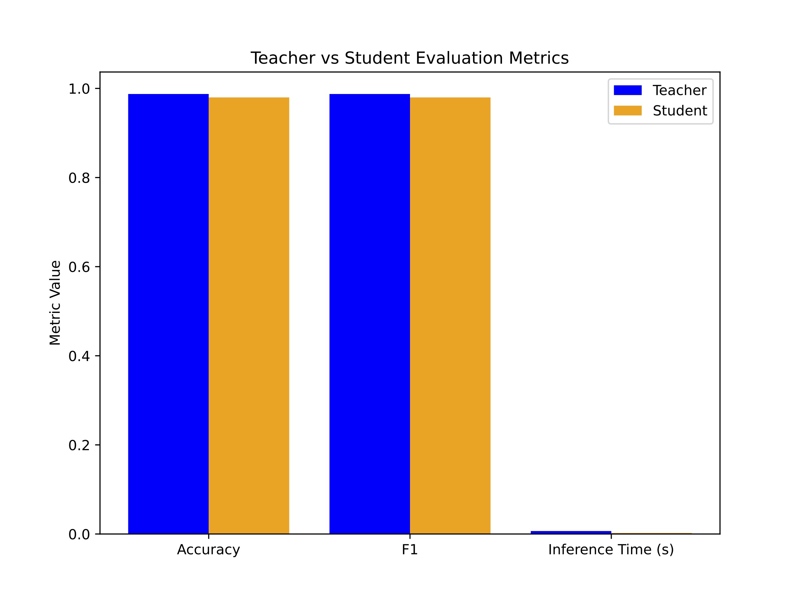
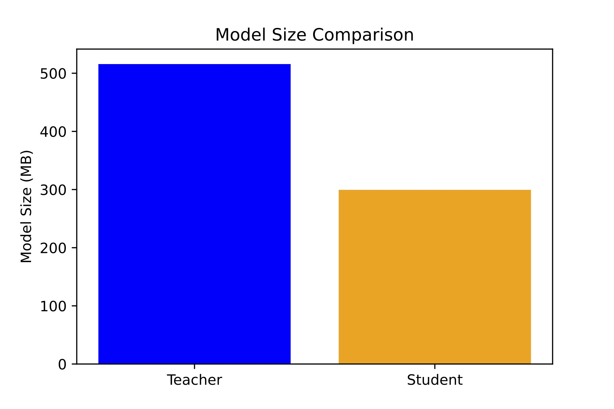
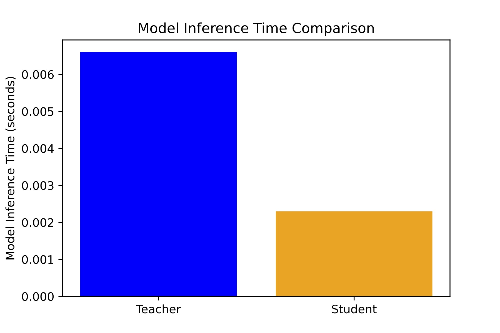

# Distilled-Arabic-Text-Classifier-model


This model ( [on HuggingFace](https://huggingface.co/AimanGh/distilled_arabic_text_classifier) ) was produced in two steps: first, a BERT model was fine-tuned on an Arabic dataset ( [SANAD dataset](https://www.kaggle.com/datasets/haithemhermessi/sanad-dataset)). 
Then, the fine-tuned model was distilled.
The goal is to reduce model size and inference time while maintaining as much accuracy as possible.










## ✨ **Model Overview**

**Training pipeline:**
1️**Teacher model:** A BERT model was fine-tuned on the SANAD dataset (for the categories, see the dataset descrption in the link above).  
2️ **Student model:** A smaller student BERT was created by **reducing the number of hidden layers to 4**.  
3️ The student was trained using **knowledge distillation**, combining the teacher’s soft outputs and the true labels.

This approach:
-  **Reduces model size**
-  **Speeds up inference**
- **Maintains high classification performance**

---

##  **Dataset**

- **Name:** [SANAD](https://www.kaggle.com/datasets/mohammadamiqbal/sanad-news-dataset)
- **License:** U.S. Government Works 
- **Labels:**  
  - 0: Culture  
  - 1: Finance  
  - 2: Medical  
  - 3: Politics  
  - 4: Religion  
  - 5: Sports  
  - 6: Tech
 
  ## 📊 **Performance ( Evaluated on the SANAD dataset) **

| Metric | Teacher Model | Distilled Student |
|----------------|----------------|------------------|
| **Accuracy** | 98.75% | 97.98% |
| **F1 (weighted)** | 98.75% | 97.98% |
| **Precision** | 98.75% | 97.99% |
| **Recall** | 98.75% | 97.98% |
| **Average Inference Time** | 0.0066 sec | 0.0023 sec |

>  The student model is over **2× faster** in inference while maintaining **high accuracy**.

---

##  **How to Use**

```python

   import torch
from transformers import BertForSequenceClassification, AutoTokenizer

device = torch.device("mps" if torch.backends.mps.is_available() else "cpu")

# Load distilled student model weights
student_model = BertForSequenceClassification.from_pretrained(
    "/model_path"
)
student_model.to(device)
student_model.eval()

#  tokenizer from teacher
tokenizer = AutoTokenizer.from_pretrained(
    "/tokinzer_path"
)

# Define same label mapping
label_mapping = {
    'Culture': 0,
    'Finance': 1,
    'Medical': 2,
    'Politics': 3,
    'Religion': 4,
    'Sports': 5,
    'Tech': 6
}
id_to_label = {v: k for k, v in label_mapping.items()}

# ex text
text = "خسر ريال مدريد اليوم للمرة الثانية مباراة  الاياب"
inputs = tokenizer(
    text,
    truncation=True,
    padding="max_length",
    max_length=128,
    return_tensors="pt"
)
inputs = {k: v.to(device) for k, v in inputs.items()}

with torch.no_grad():
    outputs = student_model(**inputs)
    logits = outputs.logits
    predicted_class_id = logits.argmax(dim=-1).item()

print("Predicted ID:", predicted_class_id)
print("Predicted Label:", id_to_label[predicted_class_id])
```

 ## Limitations

- **Dataset scarcity:**  
  High-quality, large-scale Arabic text classification datasets are scarce. During fine-tuning and distillation, the only accessible dataset was the SANAD dataset cited here. This limited availability may affect the model’s generalization to other Arabic text domains.

- **Evaluation on the same dataset:**  
  The model's performance metrics (accuracy, F1, precision, recall) were measured on a test split from the same dataset used for training. Real-world performance might differ on unseen or more diverse data.

- **Class imbalance:**  
  If the dataset contains imbalanced classes, which can bias the model toward majority classes and reduce accuracy on minority classes.

- **Domain specificity:**  
  The model is fine-tuned on the SANAD dataset's topics and text style. Performance on other Arabic dialects, genres, or domains may be lower.


